# Bookstore Postgres数据库项目

[](https://travis-ci.org/1012598167/bookstore)[](https://codecov.io/gh/1012598167/bookstore)

Postgres实现类似淘宝书店的功能并进行50000笔订单吞吐量测试，流程可参考.travis.yml

演示页[47.101.151.73:5001/auth/login](http://47.101.151.73:5001/auth/login) 

注：主分支未加入前端(updated 20201219)

前端请去分支[developercn](https://github.com/1012598167/bookstore/tree/developercn)查看，该分支只有/be/view与/be/templates的内容与master不同

不将前端写到master分支的原因是前端使用render_template会无法测覆盖率


## 安装配置

**运行该项目的流程及安装详情请见.travis.yml**

安装python (需要python3.6以上)

安装依赖

```bash
pip install -r requirements.txt
```

执行测试

```bash
bash script/test.sh
```

bookstore/fe/data/book.db中包含测试的数据，从豆瓣网抓取的图书信息， 其DDL为：

```
create table book
(
    id TEXT primary key,
    title TEXT,
    author TEXT,
    publisher TEXT,
    original_title TEXT,
    translator TEXT,
    pub_year TEXT,
    pages INTEGER,
    price INTEGER,
    currency_unit TEXT,
    binding TEXT,
    isbn TEXT,
    author_intro TEXT,
    book_intro text,
    content TEXT,
    tags TEXT,
    picture BLOB
);
```

更多的数据可以从网盘下载，下载地址为，链接：

```
https://pan.baidu.com/s/1bjCOW8Z5N_ClcqU54Pdt8g
```

提取码：

```
hj6q
```

这份数据同bookstore/fe/data/book.db的schema相同，但是有更多的数据(约3.5GB, 40000+行)


## 项目目录结构

```
bookstore
  |-- be                            mock的后端
        |-- model                   store应在model2中
        |-- model2                  功能实现
        |-- view                    flask view
        |-- templates               演示用前端
        |-- app.py                  启动flask
        |-- ....
  |-- doc                           JSON API
  |-- fe                            前端代码
        |-- access                  各功能http访问
        |-- bench                   效率(吞吐量)测试
        |-- data                    
            |-- book.db             sqlite 数据库(book.db，较少量的测试数据)
            |-- book_lx.db          sqlite 数据库(book_lx.db， 较大量的测试数据，要从网盘下载)
            |-- scraper.py          从豆瓣爬取的图书信息数据
        |-- test                    功能性及覆盖率测试
        |-- conf.py                 测试参数，修改这个文件以适应自己的需要
        |-- conftest.py             pytest初始化配置，修改这个文件以适应自己的需要
        |-- ....
 |-- htmlcov                        
 |-- initialize_database            
 |-- picture                        
 |-- script
 |-- test_tesult
 |-- 可根据自己需要增加conf.py以连接自己的数据库
  |-- ....
```

## 第一部分——数据库设计

### ER图
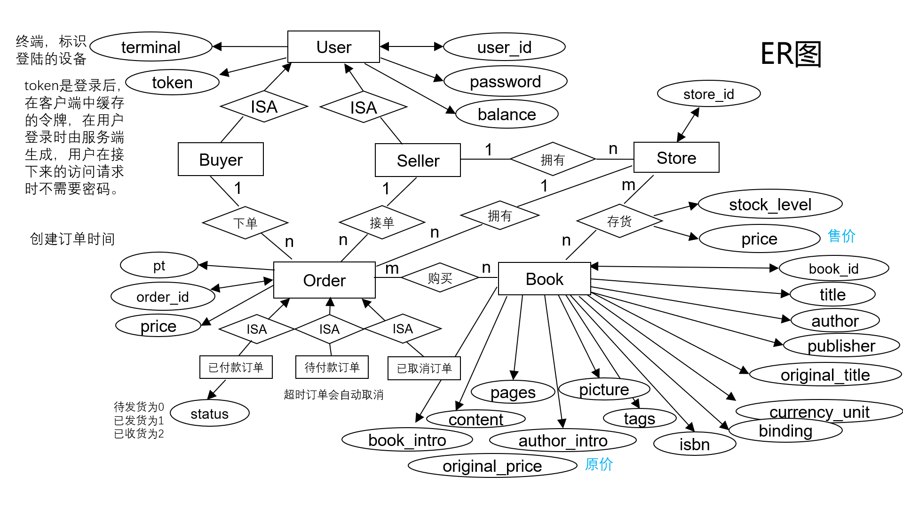

1. 实体类和子类  
    实体类：用户、商铺、订单和书籍。  
    用户的子类：买家和卖家。  
    订单的子类：已付款订单、待付款订单和已取消订单。

2. 属性  
    用户包含：唯一属性user_id，单值属性密码、余额、终端和token（登陆的用户token不会重复，但未登录的用户token均为空）。  
    订单包含：唯一属性order_id，单值属性订单应付款金额和订单创建时间（由于订单被拆分成3个子类，因此待付款和已取消订单的状态实际已经确定，只有已付款订单需要添加状态属性，明确是待发货、已发货还是已收货）。  
    店铺包含：唯一属性store_id。  
    书籍包含：唯一属性book_id，单值属性标题、作者、出版商、isbn号、原价等。  

3. 联系  
    买家和订单：一个买家可以对应多笔订单，但一笔订单只能对应一个买家。  
    卖家和订单：一个卖家可以对应多笔订单，但一笔订单只能对应一个卖家。  
    卖家和商铺：一个卖家可以拥有多个商铺，但一家商铺只能对应一个卖家。  
    商铺和书籍：一家商铺可以存有多款书籍，一款书也可以被多家商铺存有。  
    （这里需要说明，书的概念不是一本实体的书，我们把《统计学习方法》，李航，2012当作一款书，拥有一个book_id，而不是一本《统计学习方法》有一个book_id，另一本《统计学习方法》有另一个book_id，在我们的设计中它们的book_id都是一样的。从这个角度看，一家商铺可以存有多本《统计学习方法》，《统计学习方法》也可以被多家店铺所存有）。  
    订单和书籍：一个订单可以购买多款书籍，一款书也可以被多笔订单所购买。  
    订单和商铺：一家商铺可以拥有多笔订单，但一笔订单只能对应一家商铺。  

### 关系模式、索引设计及规范化

**用户表**
| user_id | password | balance | token  | terminal |
| ------- | -------- | ------- | ------ | -------- |
| String  | String   | Integer | String | String   |
其中user_id是主键，不再添加额外索引，基本都是通过user_id进行查找的，例如查看密码是否正确，还剩多少余额。设计满足第三范式。

**用户和商铺关系表**
| store_id | user        |
| -------- | ----------- |
| Stirng   | Foreign Key |
其中store_id是主键，由于外键字段上没有隐式索引，因此对user添加索引，加快商家查看店铺操作的速度。满足第三范式。

**商铺表**
| store_id    | book_id     | stock_level | price   |
| ----------- | ----------- | ----------- | ------- |
| Foreign Key | Foreign Key | Integer     | Integer |
其中store_id和book_id组成联合主键，同样由于外键字段上没有隐式索引，对store_id和book_id都建立索引，加快搜索时根据书找到对应的店铺和根据店铺找到店铺内的书。满足第三范式。

**书籍表**
| book_id | title  | author | publisher | ... | original_price | picture |
| ------- | ------ | ------ | --------- | --- | -------------- | ------- |
| Integer | String | String | String    | ... | Integer        | String  |
其中book_id是主键，不再添加额外索引。满足第三范式。

**待付款订单表**
| order_id | buyer_id    | store_id    | price   | pt       |
| -------- | ----------- | ----------- | ------- | -------- |
| String   | Foreign Key | Foreign Key | Integer | DataTime |
已取消订单表和待付款订单表一致。  
其中order_id是主键，由于订单表会频繁的插入删除，因此不再添加额外索引。满足第三范式。

**已付款订单表**
| order_id | buyer_id    | store_id    | price   | status  | pt       |
| -------- | ----------- | ----------- | ------- | ------- | -------- |
| String   | Foreign Key | Foreign Key | Integer | Integer | DataTime |
其中order_id是主键，由于订单表会频繁的插入，因此不再添加额外索引，相比于待付款和已取消订单就是多了一个标记额外状态的属性status。满足第三范式。

**订单详情表**
| order_id | book_id     | count   | price   |
| -------- | ----------- | ------- | ------- |
| String   | Foreign Key | Integer | Integer |
其中order_id和book_id组成联合主键，由于订单和书本是多对多关系，因此我们需要建立一张额外的订单详情表，同样由于会频繁的插入，因此不再添加额外索引。满足第三范式。

### 搜索图书功能
搜索方式包括：搜索标题、搜索作者、搜索标签、搜索内容关键字  
搜索范围包括：全局搜索和店铺内搜索  
搜索实现：倒排索引  

1. 搜索方式  
   **根据标题搜索**：我们时常会遇到只记住了标题部分信息的情形，因此在构建倒排索引时不仅仅记录标题内容，还提取了标题内部的信息。在处理中文标题时采用jieba分词的搜索引擎模式，在精确模式的基础上，对长词再次切分，提高召回率，若分词结果不包含标题，需加上标题本身。例如老人与海->老人、老人与海。在处理中文标题时直接按空格提取单词，再加上标题本身即可。例如：Wuthering Heights->Wuthering、 Heights、Wuthering Heights。  
   **根据作者搜索**：人名着实是不太容易记住的，我们往往会倾向于记住前面的忘记后面的信息，因此采用提示词的方式构建倒排索引，中文作家名字周国平->周、周国、周国平。对于英文作家名字拼错单词更是屡见不鲜，因此我们将提示词细化到字母层面，例如：Dumas->D、Du、Dum、Duma、Dumas。  
   **根据标签搜索**：由于标签已经存在，直接拿来构建倒排索引即可。  
   **根据内容关键词进行搜索**：我们从书中提取一些内容关键词便于用户的一些个性化搜索，采用TextRank算法（算法这里就不再赘述了）从每本书中提取至多20个关键词。例如：史蒂夫·乔布斯传->'美国', '波特兰', '企业家', '技术',  '音乐', '平板', '手机','苹果’等，提取出的结果十分符合我们的需求。
2. 倒排索引表设计  
    根据之前讲述的搜索方式我们构建出如下四张搜索表。
    **搜索标题表**
    | title  | search_id | book_id     |
    | ------ | --------- | ----------- |
    | String | Integer   | Foreign Key |
    其中title和search_id组成联合主键，不额外添加索引。
    **搜索标签表**
    | tags   | search_id | book_id     |
    | ------ | --------- | ----------- |
    | String | Integer   | Foreign Key |
    其中tags和search_id组成联合主键，不额外添加索引。
    **搜索作者表**
    | author | search_id | book_id     |
    | ------ | --------- | ----------- |
    | String | Integer   | Foreign Key |
    其中author和search_id组成联合主键，不额外添加索引。
    **搜索内容关键词表**
    | book_intro | search_id | book_id     |
    | ---------- | --------- | ----------- |
    | String     | Integer   | Foreign Key |
    其中book_intro和search_id组成联合主键，不额外添加索引。
    新增的四张搜索表也均符合第三范式。
3. 分页查询  
    最后统计下来在4万余本书中，标签是小说的有11799本，如果全部返回给用户对于数据库来说会是巨大的开销，因此需要分页查询。我们希望通过分页查询能够**减少数据库与程序之间IO的负担**，因此一次返回十条记录；也能够**减少数据库查询的负担**，因此我们新增了一个额外的属性search_id，使用查询内容和search_id组成联合主键，而不是简单的搜索内容和book_id构成全码。  
    **search_id的作用**：  
    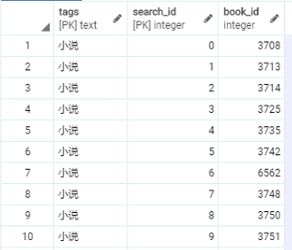  
    我们对相同的搜索内容从0开始排序，search_id记录的就是序号，就如上图所示。由于我们每次返回十条结果，将tags和search_id作为主键，检索速度非常快。这里要说明主键数据库会自动构建索引，索引是以B树的方式存在的，复合索引的列的顺序决定了B树的信息的存储的顺序。search_id是为范围查询服务的，因此tags第一列，search_id第二列。可以想象如果颠倒次序对于检索的效率会有很大影响。同时search_id的存在也不仅仅提高检索效率，因为它决定了排序的先后，这是非常有商业价值的，我们可以根据书本的销量、热度来决定search_id的先后，来改进客户体验。  
    优点：  
    对比limit和offset，虽然通过limit和offset也可以实现分页视图，但这样会扫描大量不必要的行。例如limit10000,20的意思扫描满足条件的10020行，扔掉前面的10000行，返回最后的20行，这大大增加了数据库的检索量，但检索的大部分结果都是无用的。  
    使用search_id用户可以随机跳转到任何一页，并且访问速度都和访问前十条一样快，因为我们直接定位到所要查找的位置，因此没有造成任何不必要的搜索。  
    相较于使用Postgresql中文分词库zhparser自动创建搜索分词映射规则，手动建表可以过滤掉一些无用的信息，减少数据库冗余，并且使用search_id可以进行搜索结果的个性化排序，根据实际需求和分页查询的需要手动建表能大大提高检索速度和用户体验。  
    缺点：  
    仅对全站查询有效，店铺内搜索时仍然需要使用limit（店铺不可能包含所有符合要求的书，如果强行使用会造成部分页面内容缺失，大大影响用户体验），好在用户的大部分搜索都为全站搜索，而且店铺内符合条件的书也不会太多，使用limit也在数据库可以承受的范围内。  
    删除书本代价较高，试想如果我们删除了book表中的某一本书，除了要删除所有search表中的对应项外，排在其之后的都要向前移动。但一般不会删除一本书，除非这本书带来的社会影响十分恶劣。如果非要删除，我们可以通过定期更新所有search表，用户访问已删除书本，时提示书本不存在（用户仍然可以搜索到该书），而且如果search_id是根据热度排序的，那么定期更新所有的search表也是需要的，此时可以将被删除的书本从search表中删除。  
创建四张search表耗时大约2小时（7184秒，此次实验的booklx），构建倒排索引时也考虑到空间上的开销，存储的都是必要有意义的信息，耗费时间和占用空间都在我们可接受的范围内。

## 第二部分——功能实现与性能分析

### 功能实现与性能分析

**auth功能**

1. 注册
    1. 根据user_id判断该用户名是否已经存在。
    2. 插入user_id、password、balance、token、termial信息至usr表。  
    
    性能分析：  
    usr表一次根据主键查询，一次插入。

2. 登录
   1. 根据user_id获取用户密码。
   2. 与用户输入密码对比。
   3. 更新token，terminal。  
   
    性能分析：  
    usr表一次根据主键查询，一次更新。

3. 登出
   1. 根据user_id查询该user是否处于登陆状态。
   2. 更新token。  
   
    性能分析：  
    usr表一次根据主键查询，一次更新。

4. 注销
   1. 根据user_id查询该user是否存在。
   2. 删除对应user表中条目。  
   
    性能分析：  
    usr表一次根据主键查询，一次删除。

5. 更改密码
   1. 根据user_id获取用户原有密码。
   2. 与用户输入的旧密码对比。
   3. 若相同，更新用户密码。 
   
   性能分析：  
   usr表一次根据主键查询，一次更新。

**seller功能**

6. 创建店铺
   1. 检查user_id和store_id是否已存在。
   2. 插入用户id，新建店铺store_id至user_store表。  
   
    性能分析：  
    usr表一次根据主键查询，store表一次根据主键查询，store表一次插入。

7. 上架图书
   1. 检查user_id和store_id是否已存在。
   2. 根据book_id从book表查询是否存在对应book。
   3. 若不存在，首先将书本信息插入book表。
   4. 将store_id, book_id, 出售价格插入store表。  

    性能分析：  
    usr表一次根据主键查询，store表一次根据主键查询，book表一次根据主键查询（book表一次插入，可选），store表一次插入。

8. 添加库存
    1. 检查user_id、store_id和book_id是否已存在。
    2. 根据store_id, book_id寻找对应店家书本库存，并在store表中更新库存。  
    
    性能分析：  
    usr表一次根据主键查询，store表一次根据主键查询，一次更新。  

9. 卖家发货
    1. 根据order_id在new_order_paid表中查询对应的订单状态，店铺id。
    2. 检查订单状态是否为待发货，店铺id与卖家id是否对应。
    3. 若符合条件，则更新订单状态为已发货。

    性能分析：  
    new_order_paid表一次根据主键查询，一次更新。  
    测试用例：  
    正常情况/user_id与store_id不对应/order_id不存在/订单已发货

**buyer功能**

10.  充值
    1. 根据user_id获取用户密码。
    2. 与用户输入密码对比。
    3. 若密码正确，在usr表中更新用户余额。  

    性能分析：  
    usr表一次根据主键查询，一次更新。

11. 下单
    1. 根据订单信息（book_id,购买数量，store_id）在store表中查找商户中是否存在对应书籍和足够的库存。
    2. 若满足条件，则在库存中减去对应的数量，并在new_order_detail表中插入对应的订单id，book_id，购买价格，购买数量。计算总价格。  
    3. 若所有条件都满足，则在new_order_pend表中插入对应的订单id，买家id，店铺id，订单总价，下单时间。  
    
    性能分析：  
    store表一次根据主键查询，一次更新，new_order_detail表一次插入，new_order_pend表一次插入。

12. 付款  
    1. 查询在new_order_pend表中是否存在属于用户的代付订单，获取订单总价，商户id。
    2. 若存在，根据user_id获取用户密码。
    3. 与用户输入密码对比。
    4. 若密码正确，且用户余额大于代付价格，则付款成功，否则失败。
    5. 若付款成功，则根据卖家id在usr表中给卖家增加余额。
    6. 从new_order_pend表中删除对应订单信息，在new_order_paid表中加入订单信息。  
    
    性能分析：  
    new_order_pend表一次根据主键查询，user表两次根据主键查询，两次更新（一次买家、一次卖家），new_order_pend表一次删除，new_order_paid表一次插入。


13. 买家收货
    1. 根据order_id在new_order_paid表中查询对应的订单状态，买家id
    2. 检查订单状态是否为已发货，订单id与买家id是否对应。
    3. 若符合条件，则更新订单状态为已收货。

    性能分析：  
    new_order_paid表一次根据主键查询，一次更新。
    测试用例：
    正常情况/user_id与order_id不对应/order_id不存在/订单已收货

14. 查询订单记录
    1. 根据buyer_id在new_order_paid表中筛选记录，然后根据book_id,order_id对book表,new_order_paid表和new_order_detail表进行merge操作，获取订单id，所购书名，价格，数量，购买时间，订单状态。
    2. 在待付款表中进行相同的操作。
    3. 根据order_id将获取的记录包装成json对象，每个order下包含由所购书名，价格，数量包含的数组。

    性能分析：  
    new_order_paid表一次查询，book表、new_order_paid表和new_order_detail表一次merge操作，new_order_pend表一次查询，book表、new_order_pend表和new_order_detail表一次merge操作。
    测试用例：
    正常情况/user_id不存在/用户无购买记录

15. 手动取消订单  
    只有未发货或未付款情况下才能取消订单
    1. 根据order_id和buyer_id在new_order_pend或new_order_paid表中获取商户id，订单价格。
    2. 确定订单未发货后。根据order_id，store_id在new_order_detail表中筛选记录，然后根据book_id对store表和new_order_detail表进行merge操作，在store表中加回库存。
    3. 在usr表中更新买家余额。
    4. 在usr表中更新卖家余额。
    5. 将订单信息加入new_order_cancel表中。
    6. 在待付款表/已付款表中删除对应记录。

    性能分析：
    new_order_paid表一次查询，new_order_pend表一次查询，其中一张表一次删除，new_order_cancel表一次插入，new_order_detail表一次查询，store表不定次更新（取决于购买件数），user表两次根据主键查询，两次更新（一次买家、一次卖家）。
    测试用例：
    已付款/未付款/user_id不存在/已发货  

16. 自动取消订单  
    实现逻辑：  
    每隔一秒会新起一个线程去做检查完所有订单是否超时并将超时的任务删除，而可能超时的订单（在下单时）被存在字典中。相比每秒反复从数据库中读订单数据的耗时，或在数据库中维护取消时间的耗时，开启与关闭线程的时间忽略不计(测试约0.0001s)。  
    考虑了使用python库threading，schedule后决定使用threading，其开启线程可以保证一秒内处理不完该批超时的订单，其余线程也会等该批任务做完，再去做自己的任务。 
    特殊情况：  
    而一般我们会使用threading.Timer.start，这样起的线程会在需要终止的时机无法终止（没有标识号，也没有全局变量能充当该线程），这会导致正常运行时无法关闭服务器（每秒至少有一个线程在运作），并且test coverage也将无法正常退出。  
    解决方案：  
    新建线程类，定义方法，在需要终止服务器时调用取消所有的Timer。
    
     ```python
    import threading
import time
    
    class TimerClass(threading.Thread):
        def __init__(self):
            threading.Thread.__init__(self)
            self.event = threading.Event()
        self.count = 10
    
        def run(self):
            while self.count > 0 and not self.event.is_set():
                print (self.count)
                self.count -= 1
            self.event.wait(1)
    
        def stop(self):
        self.event.set()
    
     ```
    性能分析：  
对于每秒新起的线程，若要取消10笔订单约0.3s左右(时间多花在数据库访问延迟)，对小量数据能尽量保证当前时间后1s内能取消完当前时间1分钟前的订单，这样保证最多只有60个线程（至少一个）在运作。
    
17. 搜索  
    提供的所有操作如下：
      

    全局搜索
    1. 根据作家搜索
    2. 根据书本信息搜索
    3. 根据标签搜索
    4. 根据题目搜索  
    实现逻辑：使用第一部分提到的索引，以全文或店内搜索书本信息为例，select语句如下：
    ```python
    records = self.session.execute(
                " SELECT title,author,publisher,book.book_intro,tags,picture "
                "FROM book WHERE book_id in "
                "(select book_id from search_book_intro where book_intro='%s' and search_id BETWEEN %d and %d)" % (
                book_intro, 10*page-10,10*page-1)).fetchall()
    ```
    店铺内搜索
    1. 根据作家搜索
    2. 根据书本信息搜索
    3. 根据标签搜索
    4. 根据题目搜索
    ```python
    records = self.session.execute(
                " SELECT title,author,publisher,book.book_intro,tags,picture "
                "FROM book WHERE book_id in "
                "(select book_id from search_book_intro where book_intro='%s') and "
                "book_id in (select book_id from store where store_id='%s')"
                "LIMIT 10 OFFSET %d"% (book_intro, store_id,10*page-10)).fetchall()
    ```
    性能分析：  
    usr表一次根据主键查询，一次更新。全局与店内搜索除去前端延迟因素搜索延迟不会超过0.1s（执行select语句）。（不需要将整张表取出，用户可指定搜索页数）

18. 以图搜图（感知哈希）  
    背景：每张图片都可以通过某种算法得到一个 hash 值，称为图片指纹，两张指纹相近的图片可以认为是相似图片。
    以图搜图的原理：获取你上传的图片的指纹，和图库的图片指纹对比，查找出最相似的若干张图片展示。

    以图搜图算法：

    1. 差值哈希：Dhash（Difference Hash）
    2. 均值哈希：Ahash（Average Hash） 
    3. 感知哈希：Phash（Perceptual Hash）（增强版Ahash）
    4. 小波哈希：Whash（Wavelet Hash）
    本例中使用感知哈希，算法步骤如下：
    Step1：缩小图片尺寸
    step2：转为灰度图片
    step3：计算灰度平均值（离散余弦变换DCT）
    step4：比较像素的灰度
    step5：计算哈希值
    step6：对比图片指纹

    性能分析：
    图片数据还是存在数据库中，由于一张图片取出需要BufferReader转byte64(<0.01s)转PIL(约0.05s)，故30000张图延时极高，所以只考虑100张图（约1s），实际上若单搜图功能而言，可以将感知哈希完了的64bit的数据存在本地或是数据库，再取则几乎没有延时。

由于所有表都建立在关系型数据库postgreSQL上，上述功能都遵循事务的方式进行处理，能够确保Serializable级别的事务隔离，确保ACID。

### 测试及代码覆盖率
```bash
bash script/test.sh
```
在实现功能前我们先针对我们要完成的功能编写相应的test case，之后再进行功能的实现，**符合测试驱动开发的方法**，最后所有测试全部通过，符合我们的预期。
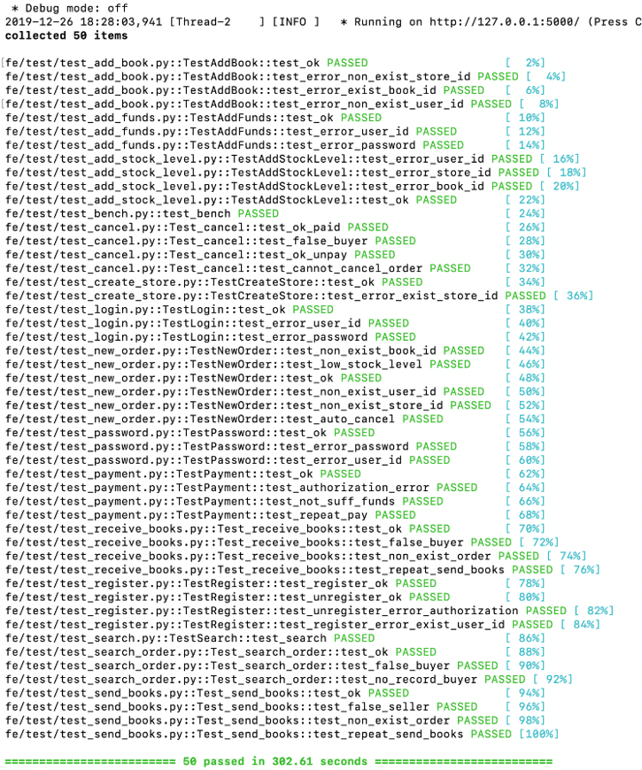
代码覆盖率达到91%，在如此大的项目中是一个比较高的覆盖率了，而且核心组件buyer.py、seller.py和user.py的覆盖率均大于等于91%。
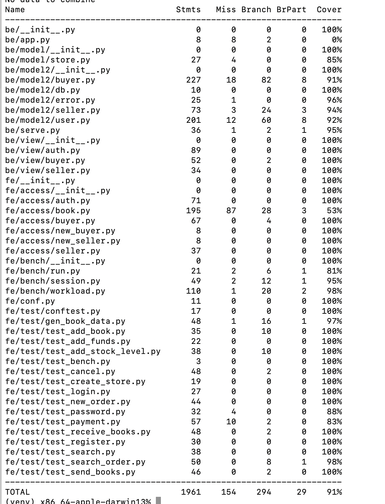

### 订单吞吐量和延迟
小表吞吐量：
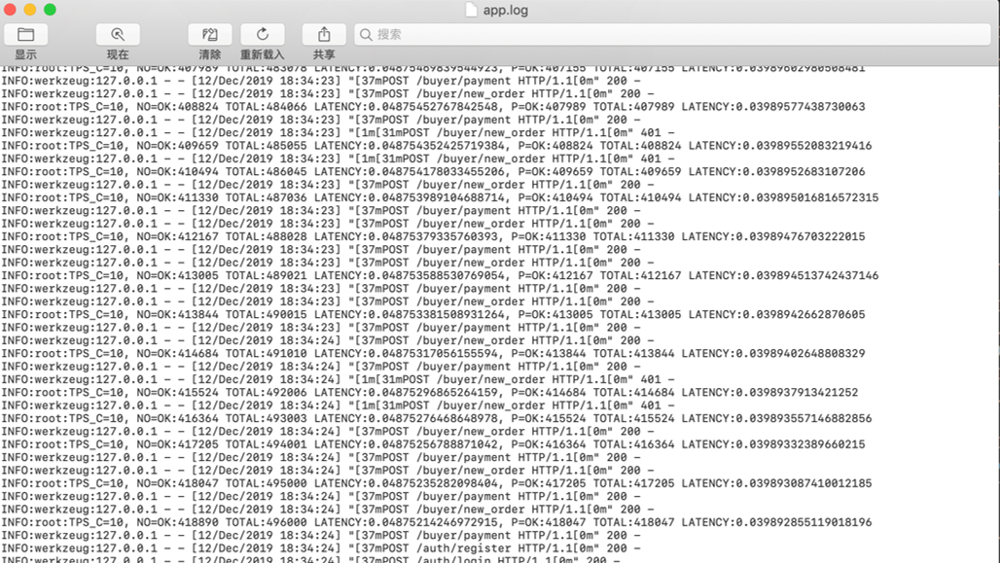
延迟：0.0487秒/笔  
吞吐量：10笔/秒

大表吞吐量：
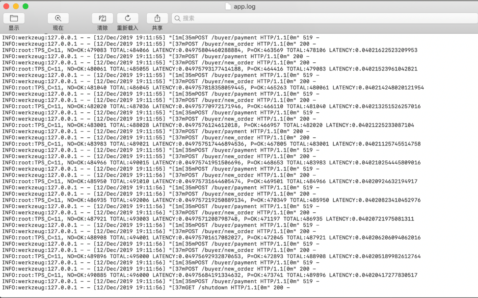
延迟：0.0497秒/笔  
吞吐量：11笔/秒  
测试平台：MacBook Pro 2018

分离负载生成和后端：
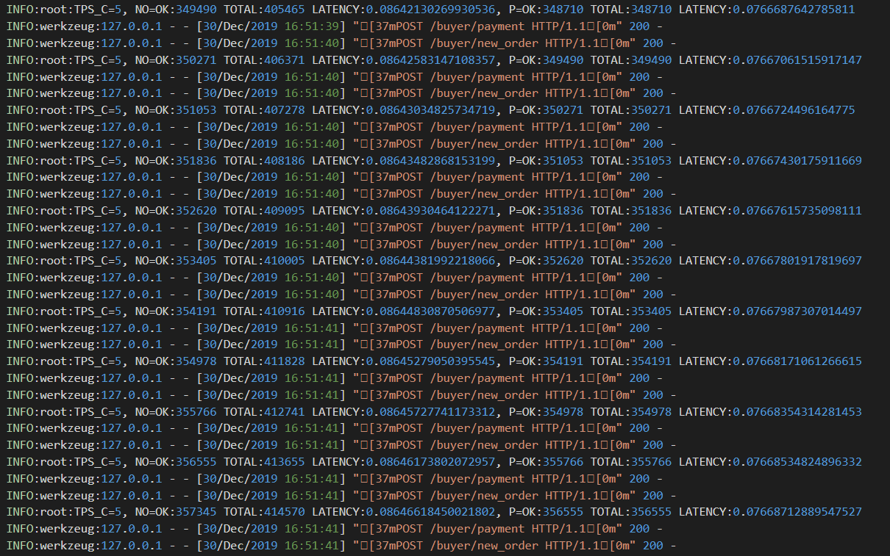
延迟：0.0864秒/笔  
吞吐量：5笔/秒  
测试平台：远程连接实验室计算机

吞吐量修改：  
处理5万笔订单用时在5分钟以内，如果是这个吞吐量不可能在5分钟之内完成，而且吞吐量并不是逐渐上升到饱和的趋势，始终保持不变。查看代码我们发现吞吐量计算时没有考虑到并发数，正确计算方法应该为：创建订单数量/(创建订单用时/并发数)，更改后在实验室计算机分离负载生成和后端运行结果如下：
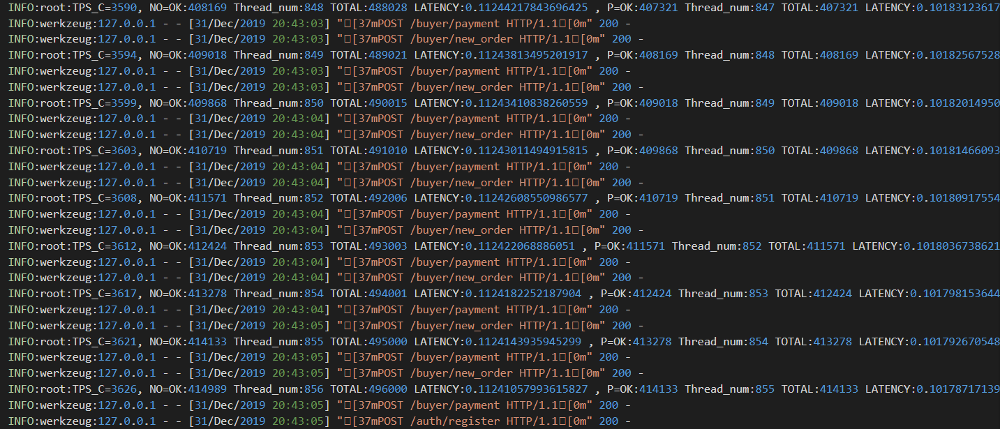
吞吐量逐渐增长至3600笔/秒左右，这个吞吐量比较符合我们的预期，同一秒内两个ok的差值和现在测得的吞吐量十分接近，证明我们的修改比较合理。

在MacBook Pro 2018平台上我们得到了更好的性能，最后吞吐量接近9000笔/秒，在我们看来这是一个非常不错的结果了^_^。

## 第三部分——版本控制、分离负载与前端部署

### 附加功能 图片搜索

### git版本控制

我们试用了 Orgnizations，在github.com/1012598167下建仓库并添加合作作者直接clone我们的项目，以及fork到另两位组员的仓库并向该仓库发起pull request请求三种方式，最终采用第二种三者地位都平等的方式。

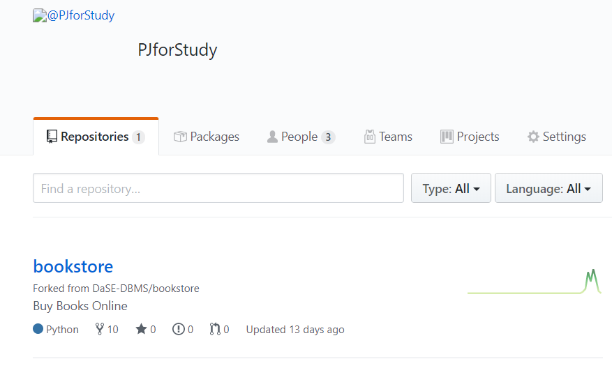


理由是使用第二种方法可以避免发起pull request再手动通过的方式，实现多人快速平等合作。（可以直接clone github.com/1012598167，并可以直接push）（远程可以建不同分支实现不同功能）


并及时pull request至master分支。

若有更新，成员确保及时fetch并merge -s ours origin/master到本地（每人的pycharm配置文件不同），成员自己本地会维护多个分支，以防本地编写错误的急救以及各功能的控制。


具体使用如下：

- 个人控制：

本地维护多个branch，以作为备份和多功能的分离实现，若需合并再使用merge。

- 多人合作：

  个人提交：git push，并及时pull request至master，而每次写自己部分的代码时及时拉取至本地。先使用git fetch origin master，至origin/master,再get merge并进行检查，以确保每人编写代码时代码内容都为最新。

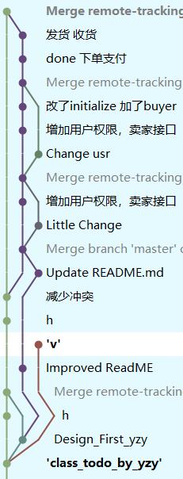

远程两个主要分支，master分支用于所有后端，可以通过测试，developercn分支用于前端，连接云服务器的数据库，延时相对较大（但是前端访问延迟高只是因为浏览器没有缓存，个人测所有网页跳转几乎无延迟），其由于使用的0.0.0.0，故本地和利用远程ip都能访问，甚至windows本地也可作为反向代理需要用的一台服务器。上交的两份代码分别为master的功能及developercn的功能。

### 分离负载

连接印张悦本地计算机的数据库，或是云服务器数据库（位于磁盘）。

代码运行在王子玥或陈诺的电脑，而访问请求任何人都可以通过(http://[2001:da8:8005:4056:81e9:7f6c:6d05:fe47]:5000/auth/search_all)访问印张悦的数据库或是通过(http://47.101.151.73:5001/auth/login或https://noname.asia)访问云端的数据库。

### 前端与云端部署

前端使用html+css+jquery实现，部分功能及展示如下：

登录界面

（jquery实现身份验证：

1.登录后生成token

2.用户端将token保存至cookie

3.需要执行操作时取出放入headers并于数据token对比验证）

（jquery保证以下所有功能都用户只有输入内容才能点击执行）

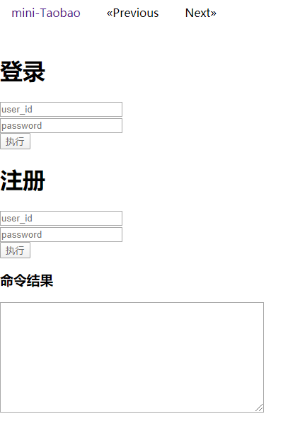

自动跳转界面：


买家操作：

其中输入将经过格式化，支持一个订单一行输入。(上方Previous和Next可用于切换所有操作界面)


输出结果位于


卖家操作：


权限操作：


搜索图片操作:


搜索信息操作：


以上图片是使用字符串生成的html（一个字符一个字符打印）。

如果未找到图片，结果如下：


用户还能直接点击title查看该书有哪些商家正在售卖。

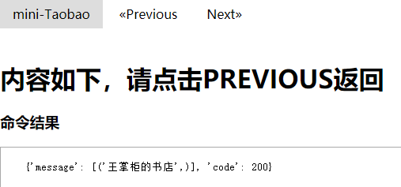

### 反向代理分离负载及nginx重定向

使用了nginx重定向保证用户访问ip就可301跳转到操作界面，而访问域名便映射至ip。

反向代理：使用多台服务器，保证多用户访问时分离负载至每台服务器，并且可以隐藏服务器的地址，更加安全。

### 一些小问题

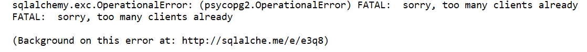


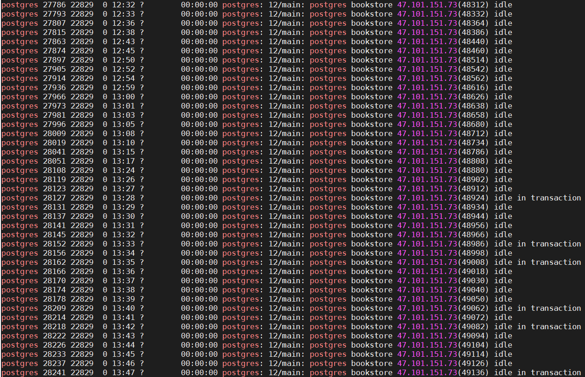

pg_stat_activity 是一张postgresql的系统视图，它的每一行都表示一个系统进程，显示与当前会话的活动进程的一些信息，比如当前会话的状态和查询等。它的state字段表示当前进程的状态，一共有六种：
1. Active(活动): 进程正在执行某个语句
2. Idle(空闲): 进程正在等待客户端的指令
3. idle in transaction(事务空闲):进程在处理事务的过程中，但当前没有执行任何语句
4. idle in transaction (aborted)(事务空闲-退出):除了事务中声明一个错误外，其余情况与idle in transaction相同
5. fastpath function call(快速通道函数调用): 后台正在执行某个快速通道函数
6. Disabled(禁用): 报告状态被禁用  
可以看到有些事务处于空闲态（有用户正在浏览界面但是没有操作），有些正处理事务但没有提交，

对于处理idle in transaction,可以设置timeout=500s到时就释放


对于idle，可以将max_connection设至10000，保证不会连不上。

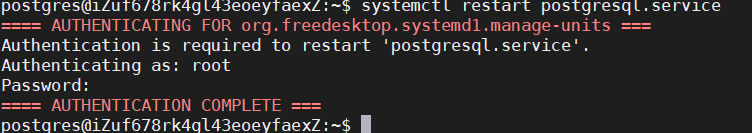

重启服务使之生效。

使用可视化分析数据，以备未来需对真实数据进行数据分析。

### 可视化

使用superset可视化分析数据，以备未来需对真实数据进行数据分析。

以下为book表中tags生成的词云：


## 链接

项目前端链接位于请使用[47.101.151.73:5001/auth/login](http://47.101.151.73:5001/auth/login)(写的很烂很简陋，仅做参考)。github地址：[github.com/1012598167/bookstore](https://github.com/1012598167/bookstore)

## 分工

CN：git版本控制、自动取消订单、搜索(专家系统+以图搜图)、分离负载、前端、反向代理、可视化、持续集成、报告撰写 
YZY：数据库设计、搜索图书功能设计、分页查询设计优化、表初始化、吞吐量测试和优化、性能分析和优化、报告撰写、ppt制作
WZY：基本功能实现，拓展功能中卖家发货、买家收货、查询历史购买记录和手动取消订单功能实现、报告撰写、吞吐量测试

注：若有ppt等需求，或代码问题，可在[issue](https://github.com/1012598167/bookstore/issues)中提出或联系chennuo909@163.com
原始作业要求https://github.com/DaSE-DBMS/bookstore.git

如果您看到了这里希望您给个star！