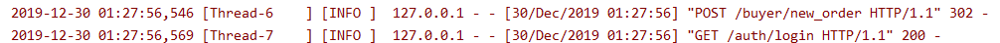

# bookstore
## 第一次更新
1. 运行脚本命令
   ```
   ./script/test.sh
   ```
2. 吞吐量在app.log下
3. 数据库初始化（先建好bookstore数据库）
   ```
   python ./initialize_database/initialize_database.py
   ```
4. 第一次测试结果在test_result文件夹下
5. ER图和导出的关系模型在database_design文件下

## git版本控制
我们试用了 Orgnizations，在github.com/1012598167下建仓库并添加合作作者直接clone我们的项目，以及fork到另两位组员的仓库并向该仓库发起pull request请求三种方式，最终采用第二种三者地位都平等的方式。


理由是使用第二种方法可以避免发起pull request再手动通过的方式，实现多人快速平等合作。（可以直接clone github.com/1012598167，并可以直接push）并且每个人在origin/下维护自己的分支，如我的为origin/developercn，


并及时pull request至master分支。

若有更新，成员确保及时fetch并merge -s ours origin/master到本地（每人的pycharm配置文件不同），成员自己本地会维护多个分支，以防本地编写错误的急救以及各功能的控制。


具体使用如下：

- 个人控制：

本地维护多个branch，以作为备份和多功能的分离实现，若需合并再使用merge。

- 多人合作：

  个人提交：采用git push origin developerxxx的方式，上传至远程的个人分支，并及时pull request至master，而每次写自己部分的代码时：

  及时拉取至本地：

  先使用git fetch origin master，至origin/master,再get merge并进行检查，以确保每人编写代码时代码内容都为最新。并且不使用rebase，本地对除master外的分支只能从master中合并再编写。


##测试驱动开发
即先写测试用例，再实现功能（写函数）
如test_add_book.py 先写test（助教给定），将self.seller.create_store self.seller.add_book留空，以作为待实现功能
再如test_search（新建）,将self.auth.search_author留空，后续再实现，这样便先有了程序的框架，结构不会紊乱

重视测试驱动开发、测试逻辑和效果展示 展示时先讲测试再讲功能实现
##注意事项

测试覆盖率请暂时移除 (覆盖率总时间没有代表性因为有延时1min 即test_new_order.py中test_auto_cancel函数，可以删) 
be\model2\try.py                     20     20      2      0     0%
be\model\buyer.py                   111    111     48      0     0%
be\model\db_conn.py                  22     22      6      0     0%
be\model\error.py                    25     25      0      0     0%
be\model\seller.py                   49     49     22      0     0%
be\model\user.py                    117    117     38      0     0%

## sqlite与postgresql数据传输
## 全文索引搜索（感知哈希以图搜图+post拉取superset作图） 取消订单（自定义class起线程）
## 前端（专家系统）
## 部署到云端
## 反代分离负载及nginx

注：由于postgresql的zhparser在全文索引查询优化上也需要新建分词索引，所以手工创建索引也可

Google 以图搜图的原理，其中的获取图片 hash 值的方法就是 AHash。

每张图片都可以通过某种算法得到一个 hash 值，称为图片指纹，两张指纹相近的图片可以认为是相似图片。

以图搜图的原理就是获取你上传的图片的指纹，和图库的图片指纹对比，查找出最相似的若干张图片展示。

除了以图搜图，图片哈希还可以做什么呢？例如图片检索，重复图片剔除，图片相似度比较等等。

这种哈希算法大概有 4 种：

1，差值哈希：DHash（Difference Hash）
2，均值哈希：AHash（Average Hash）
3，感知哈希：PHash（Perceptual Hash）
4，小波哈希：WHash（Wavelet Hash）

注：常用的是前面三种，DHash、AHash、PHash。其中 PHash 是增强版的 AHash。

感知哈希

step1：缩小图片尺寸
step2：转为灰度图片
step3：计算灰度平均值（离散余弦变换DCT）
step4：比较像素的灰度
step5：计算哈希值
step6：对比图片指纹

由于一张图byte64转PIL（imagehash只接受PIL图片）需要约0.05s的时间 ，对于三万张图而言太大，而如果直接存本地，因为服务器的磁盘性能较差，时间将花费在io上，故仅尝试前100张图做感知哈希。

以图搜图 而非ocr


不需要输入terminal：terminal = request.json.get("terminal", request.headers.get("User-Agent",""))#terminal如果不上传会默认设为User-Agent


多分支管理：主分支只有测试 developercn分支前端


不需要用户操作时验证身份了 如果用户携带的token不对 强制登出（触发方法如用户利用爬虫访问登陆后的界面，或不登录直接访问登陆后的html，所有操作都无法执行并会强制跳转到登录界面）或token超时


反向代理（ppt说明）保证延迟基本只在数据库层面 而不在多个用户访问同一服务器的延迟



（以上说明多线程）


token：使用JWT方式生成  而验证用户是否登录 靠用户每次操作时将cookie中的token以header形式发送

logout会销毁token