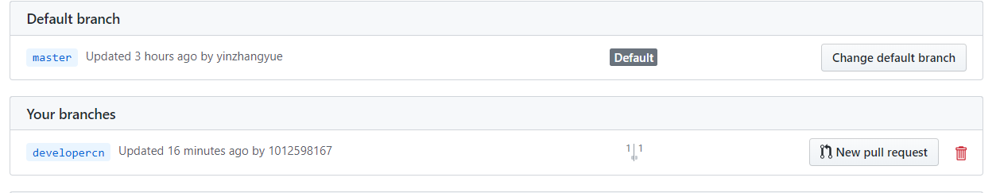

# bookstore
## 第一次更新
1. 运行脚本命令
   ```
   ./script/test.sh
   ```
2. 吞吐量在app.log下
3. 数据库初始化（先建好bookstore数据库）
   ```
   python ./initialize_database/initialize_database.py
   ```
4. 第一次测试结果在test_result文件夹下
5. ER图和导出的关系模型在database_design文件下

## git版本控制
我们试用了 Orgnizations，在github.com/1012598167下建仓库并添加合作作者直接clone我们的项目，以及fork到另两位组员的仓库并向该仓库发起pull request请求三种方式，最终采用第二种三者地位都平等的方式。


理由是使用第二种方法可以避免发起pull request再手动通过的方式，实现多人快速平等合作。（可以直接clone github.com/1012598167，并可以直接push）并且每个人在origin/下维护自己的分支，如我的为origin/developercn，



并及时pull request至master分支。

若有更新，成员确保及时fetch并merge -s ours origin/master到本地（每人的pycharm配置文件不同），成员自己本地会维护多个分支，以防本地编写错误的急救以及各功能的控制。


具体使用如下：

- 个人控制：

本地维护多个branch，以作为备份和多功能的分离实现，若需合并再使用merge。

- 多人合作：

  个人提交：采用git push origin developerxxx的方式，上传至远程的个人分支，并及时pull request至master，而每次写自己部分的代码时：

  及时拉取至本地：

  先使用git fetch origin master，至origin/master,再get merge并进行检查，以确保每人编写代码时代码内容都为最新。并且不使用rebase，本地对除master外的分支只能从master中合并再编写。


