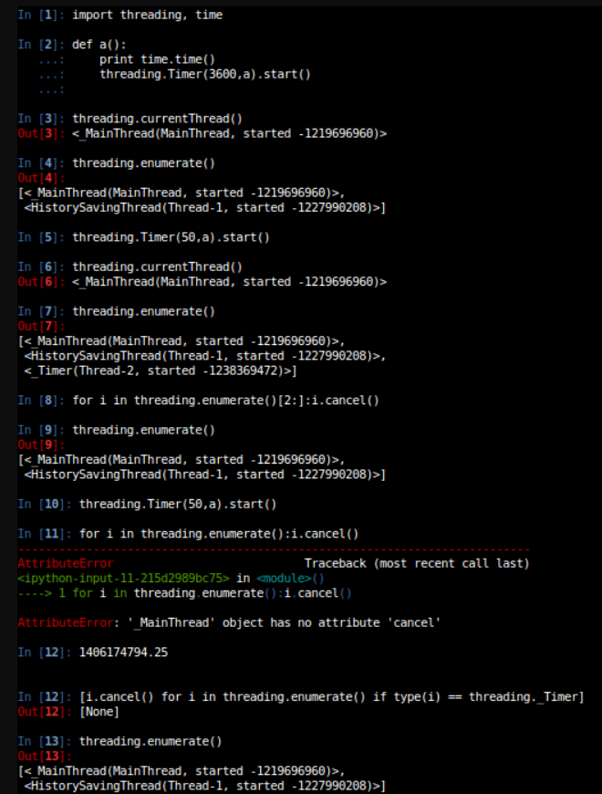

在插表过程中，多线程起不到加速的作用。（调用bookdb.send_info()或bookdb.send_info_multipool()时间
1033与1035无速度提升。）
网页反代等方法的readme在另一文件夹，还没传上来。
感知哈希实现搜图功能

多线程只能实现多线程不能节省时间


当每秒约30000条订单需要超时时，处理时间为0.008s

每隔一秒会新起一个线程去做检查完所有订单是否超时并将超时的任务删除，做完关闭线程（开启或关闭线程的时间忽略不计(测试约0.0001s)）

threading这么写可以保证 就算一秒内处理不完该批超时的订单，其余线程也会等该批任务做完，再去做自己的任务。


import time

import threading  

def a():         

  print time.time()

  threading.Timer(1,a).start()

threading.Timer(1,a).start()

这是有一个缺点的，Timer线程是以root用户的，线程不结束，主线程退出也没有，会一直处于僵死?（假死）状态，总之是杀不掉的，需要在shell中kill进程号，但是work还会存在/

递归调用需要加判断条件，必须有出口。但是加了判断也不行，假设时间长度为一个小时几个小时，线程就会停顿几个小时，【Ctrl】+【C】 是结束不掉的，必须kill，exit(-9)， sys.exit(-9)这些都杀不掉进程，即使用root 执行python也杀不掉定时任务。。。

所以当任务已完成，需要退出程序的时候，需要先stop子线程，

threading.currentThread()是获取不到Timer线程的！需要用到threading.enumerate()，


如果子线程中有用到timer，光杀死子线程也是没有用的，必须先在子线程中杀死timer线程。

使用threading.timer.start回收不了线程，导致测试无法正常结束，故方案：

```py
import threading
import time

class TimerClass(threading.Thread):
    def __init__(self):
        threading.Thread.__init__(self)
        self.event = threading.Event()
        self.count = 10

    def run(self):
        while self.count > 0 and not self.event.is_set():
            print self.count
            self.count -= 1
            self.event.wait(1)

    def stop(self):
        self.event.set()

tmr = TimerClass()
tmr.start()

time.sleep(3)

tmr.stop()
```

自己写class去中止（这真tm是个鬼才）

